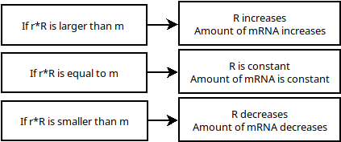

```{r setup, include = FALSE, warning = FALSE, message = FALSE}
knitr::opts_chunk$set(echo = TRUE)
knitr::opts_chunk$set(cache = TRUE)
```

```{r libaries, message = FALSE, warning = FALSE}
packages <- c()
invisible(lapply(packages, library, character.only = T))
```

# Opdracht 1
In deze opdracht gebruiken wij het volgende model:
$$\frac{\Delta R}{\Delta t} = -r * R + m $$

* r is de mate waarin de transcriptie vervalt.
* R is de hoeveelheid transcriptie.
* m is de hoeveelheid transcriptie die per seconde wordt geproduceerd.

* [1] Welke parameters moet je programmeren?
  - Alle parameters van het rechterlid.
* [2] Zoek bronnen op internet die uitleggen waar de formule dR/dt = -rR + m vandaan komt.
  - https://www.math.arizona.edu/~faris/ode.pdf
  - https://arep.med.harvard.edu/pdf/Chen99.pdf
* [3] Teken het biologische model en leg de vertaling naar de formule uit.
  - 
  - Dit model legt uit wat de invloed is van een veranderende transcriptie factor op het uiteindelijk geproduceerde mRNA.
* [4] Wat is de return waarde van de model functie in R? Waarom return je die en niet R zelf?
  - De return waarde is $$\frac{\Delta R}{\Delta t}, je returnt deze omdat R niet verandert.

